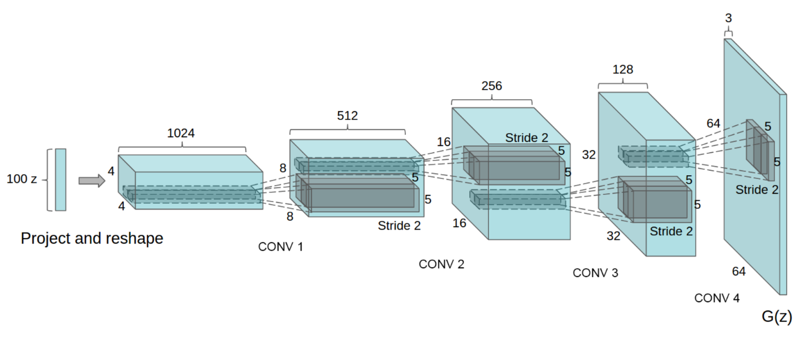
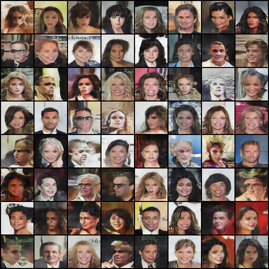
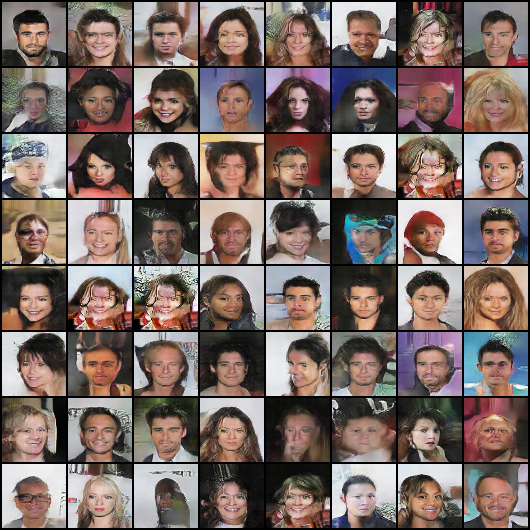

# DCGAN in Pytorch

An Pytorch implementation of [Deep Convolutional Generative Adversarial Networks](http://arxiv.org/abs/1511.06434) which is a stabilize Generative Adversarial Networks. The referenced torch code can be found [here](https://github.com/soumith/dcgan.torch).


Great Thanks to Lilian's Work [From GAN to WGAN](https://arxiv.org/abs/1904.08994) which helps me a lot in understanding the lost functions.




## Prepare Data
+ download celeba_aligned data [here]() and extract
+ prepare training data using **LMDB**, ***which save your DISK.***
```sh
# modify the path to where you extract the data in the preparedata.py file.
python preparedata.py
```

## Train

```
# modify the path where you store your `LMDB` files
python train.py
```

## Generate

```
python infer.py
```

## Result


